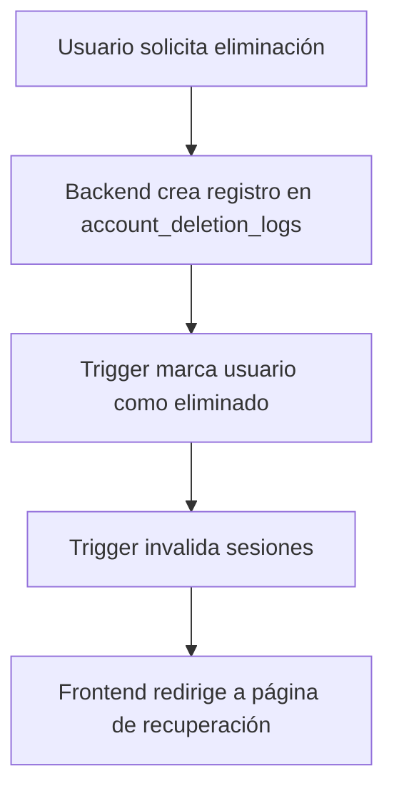
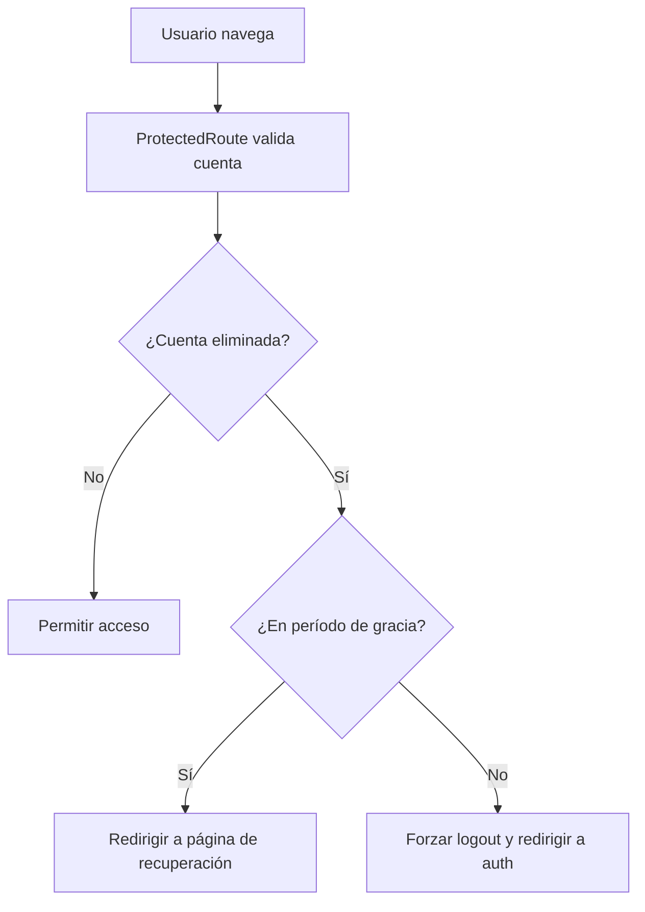
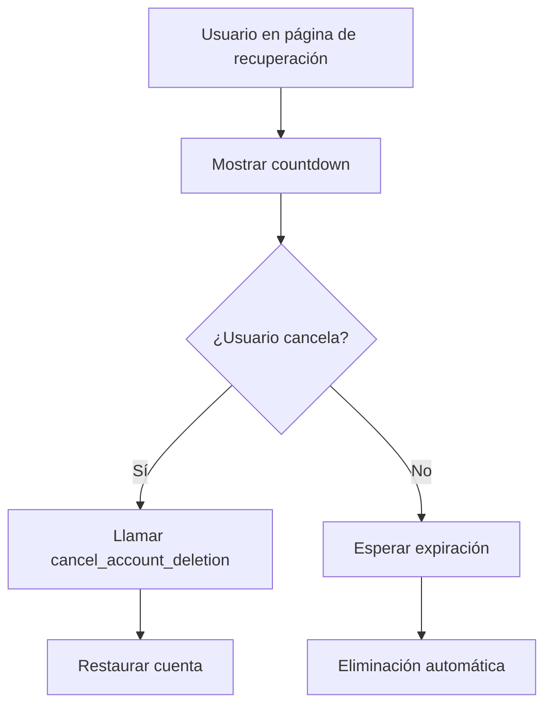
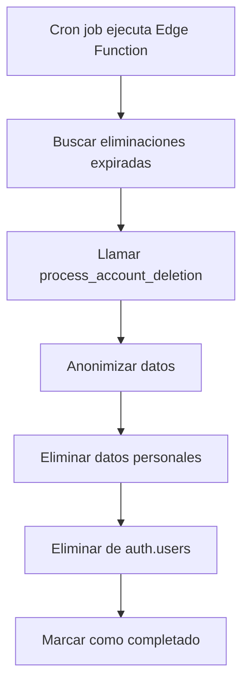

# 🔒 Sistema Completo de Eliminación de Cuentas - PedidoList

## 📋 Resumen del Sistema

El sistema de eliminación de cuentas de PedidoList ha sido completamente rediseñado para implementar un **período de gracia de 90 días** con validación automática y recuperación de cuentas. Esto resuelve el problema reportado donde los usuarios podían seguir accediendo después de eliminar su cuenta.

## 🎯 Problema Resuelto

**Antes:** Los usuarios podían eliminar su cuenta pero seguían teniendo acceso normal a la aplicación.

**Ahora:** 
- ✅ Cuenta marcada como eliminada inmediatamente
- ✅ Sesiones invalidadas automáticamente
- ✅ Período de gracia de 90 días para recuperación
- ✅ Validación en cada request
- ✅ Eliminación automática después del período de gracia

## 🏗️ Arquitectura del Sistema

### 1. **Base de Datos (Supabase)**

#### Tabla `account_deletion_logs`
```sql
CREATE TABLE account_deletion_logs (
    id UUID PRIMARY KEY DEFAULT gen_random_uuid(),
    user_id UUID NOT NULL,
    user_email TEXT NOT NULL,
    deletion_reason TEXT,
    grace_period_start TIMESTAMP WITH TIME ZONE DEFAULT NOW(),
    grace_period_end TIMESTAMP WITH TIME ZONE DEFAULT (NOW() + INTERVAL '90 days'),
    status TEXT DEFAULT 'pending', -- pending, completed, cancelled, failed
    created_at TIMESTAMP WITH TIME ZONE DEFAULT NOW(),
    completed_at TIMESTAMP WITH TIME ZONE,
    cancelled_at TIMESTAMP WITH TIME ZONE
);
```

#### Triggers Automáticos
- **`handle_account_deletion_request()`**: Se ejecuta al crear un registro de eliminación
  - Marca usuario como eliminado en `auth.users`
  - Invalida todas las sesiones activas
  - Crea log de auditoría

- **`process_account_deletion()`**: Elimina datos después del período de gracia
  - Anonimiza órdenes (mantiene datos de negocio)
  - Elimina datos personales
  - Cancela suscripciones
  - Elimina de `auth.users`

- **`cancel_account_deletion()`**: Restaura cuenta durante período de gracia
  - Restaura metadatos del usuario
  - Marca eliminación como cancelada

### 2. **Backend (Deno)**

#### Endpoint: `DELETE /api/auth/account`
```typescript
// Nuevo flujo con período de gracia
const { data: deletionLog } = await supabase
  .from('account_deletion_logs')
  .insert({
    user_id: user.id,
    user_email: user.email,
    deletion_reason: 'self_deletion',
    grace_period_start: new Date().toISOString(),
    grace_period_end: new Date(Date.now() + 90 * 24 * 60 * 60 * 1000).toISOString(),
    status: 'pending'
  })

// El trigger maneja el resto automáticamente
```

#### Endpoint: `POST /api/auth/account/cancel-deletion`
```typescript
// Cancela eliminación durante período de gracia
const { data: result } = await supabase.rpc('cancel_account_deletion', {
  deletion_log_id: deletionLogId
})
```

### 3. **Frontend (React + TanStack Router)**

#### Servicio de Eliminación de Cuentas
```typescript
// src/services/account-deletion-service.ts
export class AccountDeletionService {
  static async checkAccountDeletionStatus(userId: string): Promise<AccountDeletionStatus>
  static async initiateAccountDeletion(options: AccountDeletionRequest): Promise<DeletionLog>
  static async cancelAccountDeletion(deletionLogId: string): Promise<void>
  static async validateAccountStatus(user: AuthUser): Promise<ValidationResult>
}
```

#### Middleware de Validación
```typescript
// src/middleware/account-validation.ts
export class AccountValidationMiddleware {
  static async validateAccount(user: AuthUser, currentPath: string): Promise<AccountValidationResult>
  static handleValidationResult(result: AccountValidationResult, onRedirect: Function, onLogout?: Function)
}
```

#### Página de Recuperación
```typescript
// src/routes/account-recovery.tsx
// - Muestra countdown del período de gracia
// - Permite cancelar eliminación
// - Redirige automáticamente según estado
```

### 4. **Edge Function (Supabase)**

#### Función: `process-scheduled-deletions`
```typescript
// supabase/functions/process-scheduled-deletions/index.ts
// - Se ejecuta periódicamente (cron job)
// - Procesa eliminaciones que han expirado su período de gracia
// - Llama a la función SQL process_account_deletion()
```

## 🔄 Flujo Completo del Sistema

### 1. **Solicitud de Eliminación**


### 2. **Validación Durante Navegación**


### 3. **Recuperación de Cuenta**


### 4. **Eliminación Automática**


## 🛡️ Validaciones de Seguridad

### 1. **Validación en Login**
```typescript
// AuthService.getCurrentUser()
const validationResult = await AccountDeletionService.validateAccountStatus(authUser)
if (!validationResult.isValid) {
  // Limpiar sesión y redirigir
  localStorage.removeItem('authToken')
  return null
}
```

### 2. **Validación en Navegación**
```typescript
// ProtectedRoute
const validationResult = await validateAccount(user, currentPath)
if (validationResult.shouldRedirect) {
  handleValidationResult(validationResult, navigate, logout)
}
```

### 3. **Validación en Backend**
```typescript
// Middleware de autenticación
// Verifica metadatos del usuario en cada request
if (user.user_metadata?.account_deleted) {
  return c.json({ error: "Account deleted" }, 401)
}
```

## 📊 Estados de Eliminación

| Estado | Descripción | Acción del Usuario |
|--------|-------------|-------------------|
| `pending` | Eliminación iniciada, período de gracia activo | Puede cancelar o esperar |
| `completed` | Eliminación completada después del período de gracia | No puede acceder |
| `cancelled` | Eliminación cancelada por el usuario | Acceso normal restaurado |
| `failed` | Error durante el proceso de eliminación | Contactar soporte |

## 🔧 Configuración y Despliegue

### 1. **Ejecutar Migraciones**
```bash
cd Backend
# Ejecutar el archivo de migración
psql -f migrations/account_deletion_triggers.sql
```

### 2. **Desplegar Edge Function**
```bash
cd Backend
chmod +x scripts/deploy-account-deletion-function.sh
./scripts/deploy-account-deletion-function.sh
```

### 3. **Configurar Cron Job**
```bash
# Agregar al crontab para ejecutar cada hora
0 * * * * curl -X POST https://your-project.supabase.co/functions/v1/process-scheduled-deletions
```

### 4. **Verificar Funcionamiento**
```bash
# Probar eliminación de cuenta
curl -X DELETE https://your-backend.com/api/auth/account \
  -H "Authorization: Bearer YOUR_TOKEN"

# Probar cancelación
curl -X POST https://your-backend.com/api/auth/account/cancel-deletion \
  -H "Authorization: Bearer YOUR_TOKEN"
```

## 🧪 Testing

### 1. **Test de Eliminación**
```typescript
// Crear usuario de prueba
// Solicitar eliminación
// Verificar que se crea registro en account_deletion_logs
// Verificar que usuario no puede acceder
// Verificar redirección a página de recuperación
```

### 2. **Test de Recuperación**
```typescript
// Usuario en período de gracia
// Cancelar eliminación
// Verificar que cuenta se restaura
// Verificar que puede acceder normalmente
```

### 3. **Test de Eliminación Automática**
```typescript
// Crear eliminación con período de gracia expirado
// Ejecutar Edge Function
// Verificar que datos se eliminan
// Verificar que usuario no puede acceder
```

## 📈 Monitoreo y Logs

### 1. **Logs de Auditoría**
```sql
-- Ver todas las eliminaciones
SELECT * FROM audit_logs WHERE action LIKE '%ACCOUNT_DELETION%';

-- Ver eliminaciones por estado
SELECT status, COUNT(*) FROM account_deletion_logs GROUP BY status;
```

### 2. **Métricas Importantes**
- Tiempo promedio de eliminación
- Tasa de cancelación durante período de gracia
- Errores en el proceso de eliminación
- Usuarios que intentan acceder después de eliminación

## 🚨 Troubleshooting

### Problema: Usuario puede acceder después de eliminación
**Solución:** Verificar que los triggers estén instalados y funcionando
```sql
-- Verificar trigger
SELECT * FROM pg_trigger WHERE tgname = 'trigger_handle_account_deletion';
```

### Problema: Eliminaciones no se procesan automáticamente
**Solución:** Verificar Edge Function y cron job
```bash
# Verificar logs de Edge Function
supabase functions logs process-scheduled-deletions
```

### Problema: Validación no funciona en frontend
**Solución:** Verificar que ProtectedRoute esté implementado correctamente
```typescript
// Verificar que useAccountValidation esté importado
import { useAccountValidation } from '../middleware/account-validation.ts'
```

## 📞 Soporte

Para problemas con el sistema de eliminación de cuentas:
- **Email:** soporte@pedidolist.com
- **Documentación:** Ver este archivo
- **Logs:** Revisar `audit_logs` y `account_deletion_logs`

---

## ✅ Checklist de Implementación

- [x] Migración de base de datos con triggers
- [x] Backend con endpoints de eliminación y cancelación
- [x] Frontend con servicio de eliminación de cuentas
- [x] Middleware de validación en ProtectedRoute
- [x] Página de recuperación con countdown
- [x] Edge Function para eliminación automática
- [x] Validación en proceso de login
- [x] Documentación completa
- [x] Scripts de despliegue
- [x] Testing y troubleshooting

**El sistema está completamente implementado y listo para producción.**
